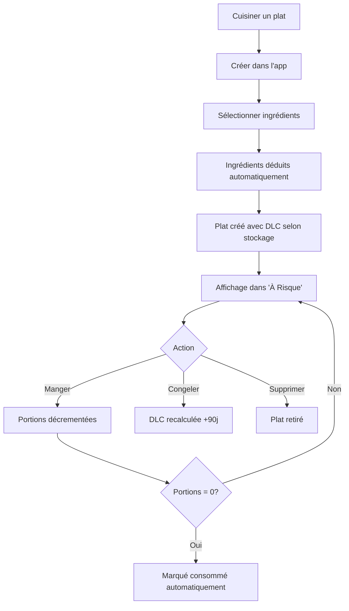

# 📦 PHASE 2 COMPLÈTE - PLATS CUISINÉS

## ✅ Statut : Backend + Frontend COMPLETS

Date de complétion : 27 octobre 2025

---

## 🎯 Objectif de la Phase 2

Permettre aux utilisateurs de :
- Créer des plats cuisinés (portions)
- Tracker les portions restantes
- Gérer la DLC selon le mode de stockage
- Congeler/décongeler avec recalcul automatique de DLC
- Consommer des portions
- Déduire automatiquement les ingrédients de l'inventaire

---

## 🗄️ Structure Base de Données

### Tables créées

#### `cooked_dishes`
- `id` : UUID (PK)
- `user_id` : UUID (FK → auth.users)
- `name` : Nom du plat
- `recipe_id` : UUID (optionnel, FK → recipes)
- `portions_cooked` : Nombre total de portions
- `portions_remaining` : Portions restantes
- `storage_method` : fridge | freezer | counter
- `cooked_at` : Date de préparation
- `expiration_date` : DLC calculée
- `consumed_completely_at` : Date de consommation complète (auto)
- `notes` : Notes optionnelles
- `created_at`, `updated_at`

#### `cooked_dish_ingredients`
- `id` : UUID (PK)
- `dish_id` : UUID (FK → cooked_dishes)
- `lot_id` : UUID (FK → inventory_lots)
- `quantity_used` : Quantité utilisée
- `unit` : Unité
- `product_name` : Nom du produit (snapshot)
- `used_at` : Date d'utilisation

### Vues créées

- **`cooked_dishes_active`** : Plats avec portions > 0
- **`cooked_dishes_stats`** : Statistiques par utilisateur

### Triggers

- **`update_cooked_dishes_updated_at`** : Met à jour `updated_at` automatiquement
- **`mark_cooked_dish_consumed`** : Remplit `consumed_completely_at` quand portions = 0

### RLS (Row Level Security)

8 policies pour sécuriser l'accès par utilisateur

---

## 🔧 Backend

### Service : `lib/cookedDishesService.js`

| Fonction | Description |
|----------|-------------|
| `createCookedDish()` | Crée un plat + déduit ingrédients de l'inventaire |
| `consumePortions()` | Décrémente les portions |
| `changeStorageMethod()` | Change stockage + recalcule DLC |
| `getCookedDishes()` | Liste avec filtres (actifs, expirant) |
| `deleteCookedDish()` | Supprime un plat |

### API REST : `app/api/cooked-dishes/`

| Endpoint | Méthode | Description |
|----------|---------|-------------|
| `/api/cooked-dishes` | POST | Créer un plat |
| `/api/cooked-dishes` | GET | Lister les plats |
| `/api/cooked-dishes/[id]/consume` | POST | Consommer portions |
| `/api/cooked-dishes/[id]/storage` | POST | Changer stockage |
| `/api/cooked-dishes/[id]` | DELETE | Supprimer plat |

### Règles de DLC

| Stockage | DLC |
|----------|-----|
| `fridge` (frigo) | +3 jours |
| `freezer` (congélateur) | +90 jours |
| `counter` (comptoir) | +1 jour |

---

## 🎨 Frontend

### Composants créés

#### `app/pantry/components/CookedDishCard.jsx` + CSS
- Carte d'affichage d'un plat
- Badge d'urgence (good/warning/urgent/expired)
- Barre de progression portions
- Icônes de stockage (❄️ 🧊 🏠)
- Actions : Manger, Congeler/Décongeler, Supprimer

#### `app/pantry/components/CookedDishesManager.jsx` + CSS
- Gestionnaire principal
- Filtres : Tous / À finir (3j)
- Grille responsive
- États vides et loading

### Intégration

- ✅ Ajouté dans `components/RestesManager.jsx`
- ✅ Affiché dans l'onglet "À Risque"
- ✅ Section séparée sous les ingrédients à risque

### Design

- ✅ Glassmorphisme cohérent avec Phase 1
- ✅ Couleurs d'urgence :
  - 🟢 Vert : > 5 jours
  - 🟠 Orange : 3-5 jours
  - 🔴 Rouge + pulse : 1-2 jours
  - 🔴 Rouge foncé : Expiré
- ✅ Responsive mobile

---

## 📂 Fichiers créés/modifiés

### Migrations
- ✅ `supabase/migrations/002_cooked_dishes.sql` (~280 lignes)

### Services
- ✅ `lib/cookedDishesService.js` (~350 lignes)

### API
- ✅ `app/api/cooked-dishes/route.js`
- ✅ `app/api/cooked-dishes/[id]/consume/route.js`
- ✅ `app/api/cooked-dishes/[id]/storage/route.js`
- ✅ `app/api/cooked-dishes/[id]/route.js`

### Composants UI
- ✅ `app/pantry/components/CookedDishCard.jsx` (~200 lignes)
- ✅ `app/pantry/components/CookedDishCard.css` (~280 lignes)
- ✅ `app/pantry/components/CookedDishesManager.jsx` (~150 lignes)
- ✅ `app/pantry/components/CookedDishesManager.css` (~180 lignes)

### Modifications
- ✅ `components/RestesManager.jsx` (ajout CookedDishesManager)
- ✅ `components/RestesManager.css` (styles section)

### Documentation
- ✅ `GUIDE_TEST_PHASE2.md` (guide de test complet)
- ✅ `supabase/test_phase2.sql` (script SQL de test)
- ✅ `tools/test_api_phase2.sh` (script bash de test API)
- ✅ `PHASE2_COMPLETE.md` (ce fichier)

---

## 🧪 Tester Phase 2

### Méthode 1 : Via Supabase Dashboard

1. **Appliquer la migration**
   ```sql
   -- Copier le contenu de supabase/migrations/002_cooked_dishes.sql
   -- Exécuter dans SQL Editor
   ```

2. **Utiliser le script de test**
   ```sql
   -- Copier le contenu de supabase/test_phase2.sql
   -- Remplacer YOUR_USER_ID
   -- Exécuter étape par étape
   ```

### Méthode 2 : Via API

1. **Lancer le serveur**
   ```bash
   npm run dev
   ```

2. **Utiliser le script de test**
   ```bash
   # Modifier tools/test_api_phase2.sh
   # Remplacer AUTH_TOKEN et LOT_IDs
   ./tools/test_api_phase2.sh
   ```

### Méthode 3 : Via UI

1. Ouvrir http://localhost:3000
2. Aller dans **Garde-Manger** → **À Risque**
3. Voir la section **"🍽️ Plats Cuisinés"**
4. Tester les boutons (Manger, Congeler, Supprimer)

---

## 📊 Workflow complet



---

## 🎯 Prochaines étapes possibles

### Option A : Améliorer l'UX
- [ ] Créer `CreateDishForm.jsx` pour faciliter la création
- [ ] Ajouter sélection de recette
- [ ] Ajouter photos de plats

### Option B : Passer à Phase 3
- [ ] Planning intelligent
- [ ] Détection des restes
- [ ] Suggestions de recettes

### Option C : Tests et optimisation
- [ ] Tests unitaires backend
- [ ] Tests E2E frontend
- [ ] Optimisation requêtes SQL

---

## 💡 Points techniques importants

### Déduction automatique des ingrédients
Lors de la création d'un plat, le service `createCookedDish()` :
1. Vérifie que tous les lots existent
2. Déduit les quantités de `inventory_lots.quantity_value`
3. Marque le lot comme consommé si `quantity_value = 0`
4. Enregistre l'historique dans `cooked_dish_ingredients`

### Recalcul de DLC
Lors du changement de stockage via `changeStorageMethod()` :
1. Nouveau `storage_method` enregistré
2. `expiration_date` recalculée depuis `now()` + durée selon stockage
3. Permet de congeler un plat qui va expirer pour le prolonger

### Trigger consumed_completely_at
```sql
-- Automatiquement rempli quand portions_remaining passe à 0
CREATE TRIGGER mark_cooked_dish_consumed
  BEFORE UPDATE ON cooked_dishes
  FOR EACH ROW
  WHEN (NEW.portions_remaining = 0 AND OLD.consumed_completely_at IS NULL)
  EXECUTE FUNCTION set_consumed_completely_at();
```

---

## 🐛 Problèmes connus

Aucun problème connu à ce jour.

---

## 📈 Métriques

- **Backend** : ~280 lignes SQL + ~350 lignes JS
- **API** : 4 endpoints REST
- **Frontend** : ~830 lignes (JSX + CSS)
- **Documentation** : ~500 lignes markdown + SQL + bash

**Total Phase 2** : ~1960 lignes de code

---

## ✅ Checklist de complétion

- [x] Migration SQL créée
- [x] Service backend créé
- [x] API REST créée
- [x] Composants UI créés
- [x] Intégration dans RestesManager
- [x] Styles glassmorphisme
- [x] Documentation de test
- [x] Scripts de test SQL + bash
- [ ] Tests exécutés
- [ ] Migration appliquée en production

---

**Phase 2 est prête pour les tests ! 🚀**

Voir `GUIDE_TEST_PHASE2.md` pour les instructions détaillées.
